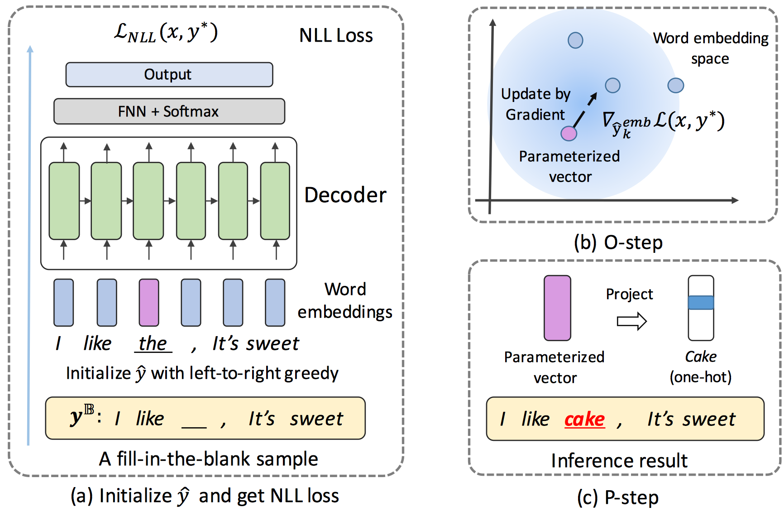

# TIGS: An Inference Algorithm for Text Infilling with Gradient Search

This repo contains the code and data of the following paper:
>**TIGS: An Inference Algorithm for Text Infilling with Gradient Search**, *Dayiheng Liu, Jie Fu, Pengfei Liu, Jiancheng Lv*, Association for Computational Linguistics. **ACL** 2019

## Overview

   

Given a well-trained sequential generative model, generating missing symbols conditioned on the context is challenging for existing greedy approximate inference algorithms. We propose a dramatically different inference approach called Text Infilling with Gradient Search (**TIGS**), in which we search for infilled words based on gradient information to fill in the blanks. To the best of our knowledge, this could be the first inference algorithm that does not require any modification or training of the model and can be broadly used in any sequence generative model to solve the fillin-the-blank tasks.

## Dependencies

- Jupyter notebook 4.4.0
- Python 3.6
- Tensorflow 1.6.0+

## Quick Start
- Training: Run `TIGS_train.ipynb`
- Inference: Run `TIGS_inference.ipynb`   

## Trained Model
Download the trained models at the link https://drive.google.com/open?id=1IABzc6ovkR6Uprnl3isSAWf6ax2fLHgH
- The APRC trained model can be found in `Model/APRC`
- The Poem trained model can be found in `Model/Poem` 
- The Daily trained model can be found in `Model/Daily` 

## Dataset
Download the datasets at the link https://drive.google.com/open?id=1GKyBtU0pPysB10wdsqMxYDoQ5CRQIXI8
- The APRC dataset can be found in `Data/APRC`
- The Poem dataset can be found in `Data/Poem` 
- The Daily dataset can be found in `Data/Daily`   
